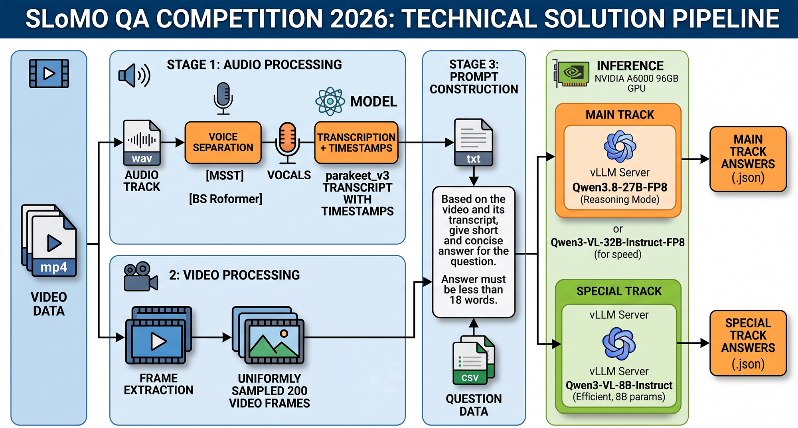

# SLoMO QA Competition 2026

Solution for the [SLoMO-QA Competition](https://eval.ai/web/challenges/challenge-page/2713/overview)

## Solution Description

For each video in the dataset, the audio track is extracted. Then, the voice is separated from the rest of the audio using the [MSST](https://github.com/ZFTurbo/Music-Source-Separation-Training/) repository and the [BS Roformer](https://huggingface.co/noblebarkrr/mvsepless_resources/tree/main/bs_roformer) model. Next, the vocals are transcribed with timestamps using the [parakeet_v3](https://huggingface.co/nvidia/parakeet-tdt-0.6b-v3) model. 

After that, we work with the video itself and the resulting text. 200 frames are uniformly sampled from the video, and the model is given the following prompt:

> Based on the video and its transcript, give short and concise answer for the question. The timestamps in the text correspond to the time in the video. Answer must be less than 18 words. Video transcript: {transcript_text} Question: {q}

Where `{q}` is the question, and `{transcript_text}` is the transcription obtained in the first stage. 

[Qwen3.8-27B-FP8](https://huggingface.co/Qwen/Qwen3.8-27B-FP8) in Reasoning mode was used as the primary model for the Main Track. The [Qwen3-VL-32B-Instruct-FP8](https://huggingface.co/Qwen/Qwen3-VL-32B-Instruct-FP8) model also performed quite well. It yielded a slightly lower metric, but demonstrated a significantly higher processing speed. 

For the Special Track, the [Qwen3-VL-8B-Instruct](https://huggingface.co/Qwen/Qwen3-VL-8B-Instruct) model with 8 billion parameters was used. Surprisingly, despite its small size, it produces rather good results.

*Note: For this solution, the models were not fine-tuned and were used out-of-the-box.*



## Requirements

All runs were performed on a single NVIDIA A6000 96GB GPU.

## Data

Download the data from Hugging Face: <https://huggingface.co/datasets/rghermi/sf20k-qa/tree/main>
* [Private test videos](https://huggingface.co/datasets/rghermi/sf20k-qa/resolve/main/sf20k_private_test_videos.zip?download=true)
* [Private test questions](https://huggingface.co/datasets/rghermi/sf20k-qa/resolve/main/sf20k_private_test_questions.csv?download=true)

## Pipeline

Place the data (videos and questions) in the `./input/` folder.

### Preprocessing

```bash
python preproc_data.py ./input/
```

### Run Inference for the Main Track

First, start the vLLM server in your first terminal:
```bash
CUDA_VISIBLE_DEVICES=0 CUDA_DEVICE_ORDER=PCI_BUS_ID \
VLLM_USE_FLASHINFER_SAMPLER=0 \
VLLM_USE_DEEP_GEMM=0 VLLM_USE_DEEP_GEMM_E8M0=0 \
python -m vllm.entrypoints.openai.api_server \
--model Qwen/Qwen3.8-27B-FP8 \
--served-model-name qwen38-27bfp8 \
--tensor-parallel-size 1 \
--max-num-seqs 64 \
--gpu-memory-utilization 0.95 \
--host localhost \
--port 8000 \
--dtype auto \
--max-model-len 131072 \
--limit-mm-per-prompt.video 1 \
--limit-mm-per-prompt.image 300 \
--allowed-local-media-path {your_local_path_with_dataset} \
--mm-processor-kwargs '{"fps": 2}' \
--media-io-kwargs '{"video": {"num_frames": -1}}'
```

* **Note:** You must provide the correct dataset path via the `--allowed-local-media-path` argument, otherwise the server won't be able to access the media files.

Then, run the main processing script in a second terminal:
```bash
python run_main_track_qwen38_27fp8_with_vllm.py ./input/
```

### Run Inference for the Special Track

First, start the vLLM server in your first terminal:
```bash
CUDA_VISIBLE_DEVICES=0 CUDA_DEVICE_ORDER=PCI_BUS_ID \
VLLM_USE_FLASHINFER_SAMPLER=0 \
VLLM_USE_DEEP_GEMM=0 VLLM_USE_DEEP_GEMM_E8M0=0 \
python -m vllm.entrypoints.openai.api_server \
--model Qwen/Qwen3-VL-8B-Instruct \
--served-model-name qwen3-8b \
--tensor-parallel-size 1 \
--max-num-seqs 32 \
--gpu-memory-utilization 0.95 \
--host localhost \
--port 8000 \
--dtype auto \
--max-model-len 131072 \
--allowed-local-media-path {your_local_path_with_dataset} \
--mm-processor-kwargs '{"fps": 2}' \
--media-io-kwargs '{"video": {"num_frames": -1}}'
```

* **Note:** You must provide the correct dataset path via the `--allowed-local-media-path` argument, otherwise the server won't be able to access the media files.

Then, run the special track processing script in a second terminal:
```bash
python run_special_track_qwen3_8b_with_vllm.py ./input/
```